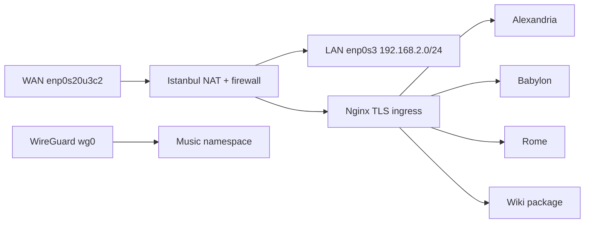

#host/istanbul #area/network #status/active
> [!abstract] Role
> Istanbul is the LAN gateway and public ingress point. It forwards traffic between `enp0s3` (LAN) and `enp0s20u3c2` (WAN), hosts DNS and HTTP/TLS entry points, and provides an isolated network path for the music automation stack.

## Module graph

`hosts/istanbul/default.nix` imports networking and `modules/default.nix`.

### Active imports

- `kmscon.nix`
- `openssh.nix`
- `SSHoTLS.nix`
- `nginx.nix`
- `ddns.nix`
- `geoip.nix`
- `dns.nix`
- `music/default.nix`, which imports the complete [[Music Stack|music stack]]

### Present but disabled

- `vector.nix`
- `suricata.nix`
- `coturn.nix`

> [!note] README versus evaluated imports
> The README names Coturn and Suricata as Istanbul services, but their imports are commented out in `modules/default.nix`. This wiki treats the import list as the current state.

## Addressing and forwarding

Istanbul is `192.168.2.1/24` on the LAN interface and has static host entries for the other internal machines. IPv4 and IPv6 forwarding are enabled. NixOS NAT is enabled from the WAN interface toward the LAN interface, with an explicit IPv4 masquerade rule in `POSTROUTING`.

For the `/24` LAN, the rough usable-host count is:

$$2^{32-24} - 2 = 254$$

## Firewall surface

- LAN DNS: TCP/UDP `53`
- Public HTTP/HTTPS: TCP `80`, `443`
- TCP `8080`
- UDP `49152-65535` for the intended Coturn range
- The LAN interface is trusted

The Coturn range is currently open even though the Coturn module is disabled; this is worth reconciling before tightening the firewall.

## Traffic shape

[^source]: `hosts/istanbul/networking.nix` - forwarding, host records, NAT, and firewall; `hosts/istanbul/modules/default.nix` - activation boundary; `flake.nix` - shared addresses, interfaces, and ports.