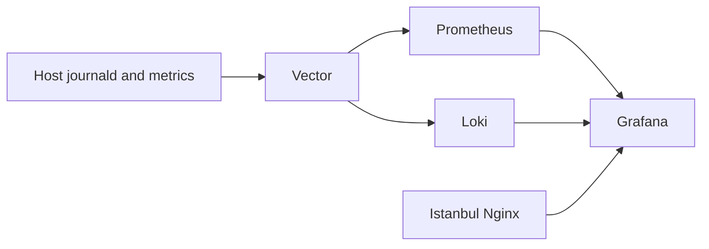

#host/rome #role/observability #status/active

> [!abstract] Role
> Rome is the observability host. It collects logs and metrics from the fleet and serves Grafana dashboards through Istanbul.

## Services

| Service | Status | Local endpoint | Note |
| --- | --- | --- | --- |
| [[Fleet Kmscon]] | Active | Local console | Console service |
| [[Fleet OpenSSH]] | Active | Host SSH | Administrative access |
| [[Prometheus]] | Active | `0.0.0.0:9696` | Metrics and remote-write receiver |
| [[Loki]] | Active | HTTP `:3100`, gRPC `:9096` | Single-node log storage |
| [[Grafana]] | Active | `192.168.2.2:2342` | Dashboards and provisioned data sources |
| [[Rome/Vector]] | Active | API on localhost `:8686` | Journald and host metrics pipeline |
| [[Dashboards]] | Active | Grafana resources | Fleet and Nginx dashboards |

## Network

Rome is `192.168.2.2/24`, uses Istanbul as gateway and DNS, and opens LAN SSH plus Prometheus, Loki, and Grafana ports. Public Grafana access is routed by Istanbul at `grafana.neekokun.com`.

## Data flow

## Change checklist

- [ ] Preserve datasource addresses when changing service ports.
- [ ] Run `nixos-rebuild dry-build --flake .#rome`.
- [ ] Check ingestion, retention, and dashboard queries after deployment.
